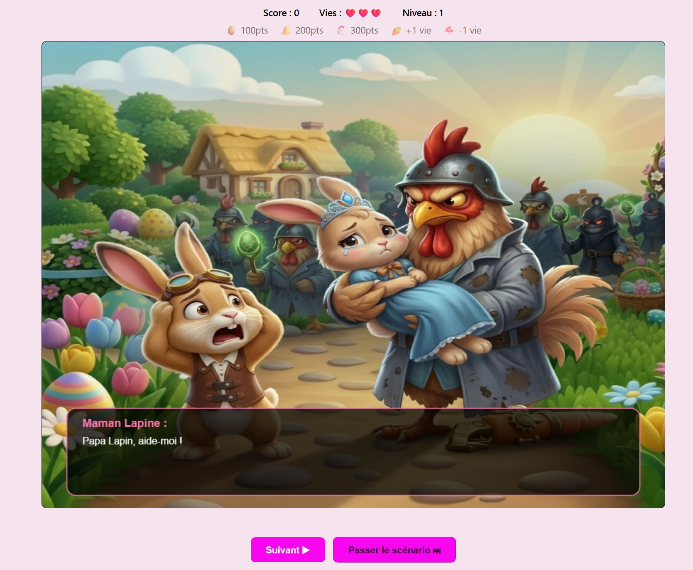
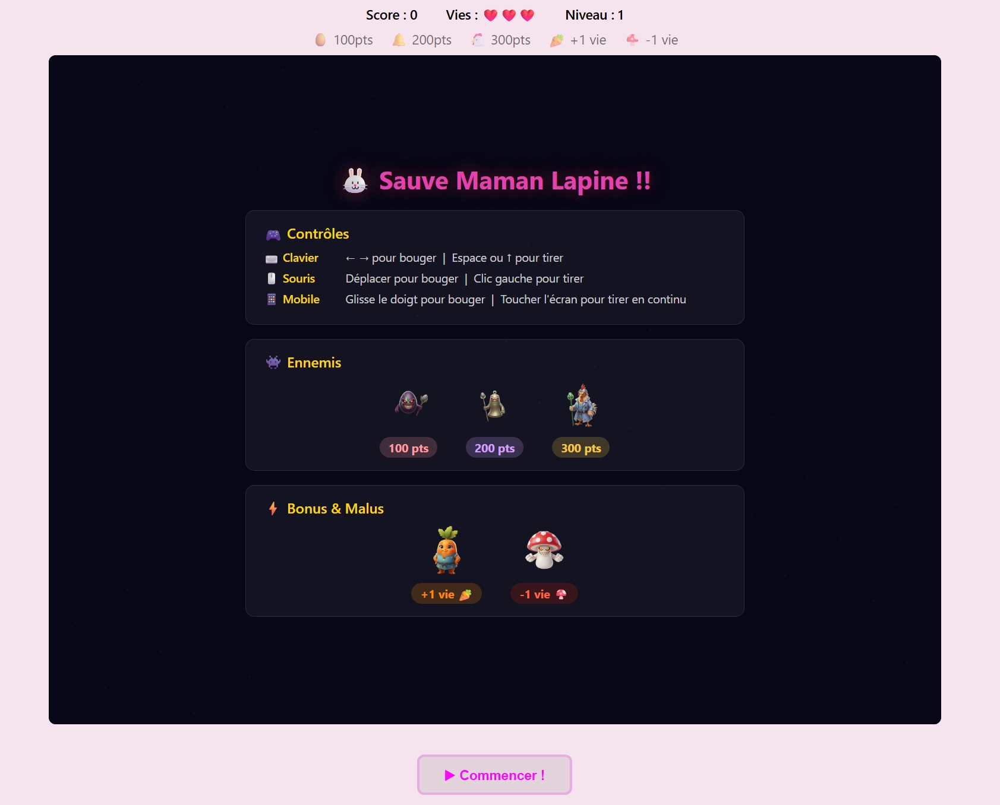
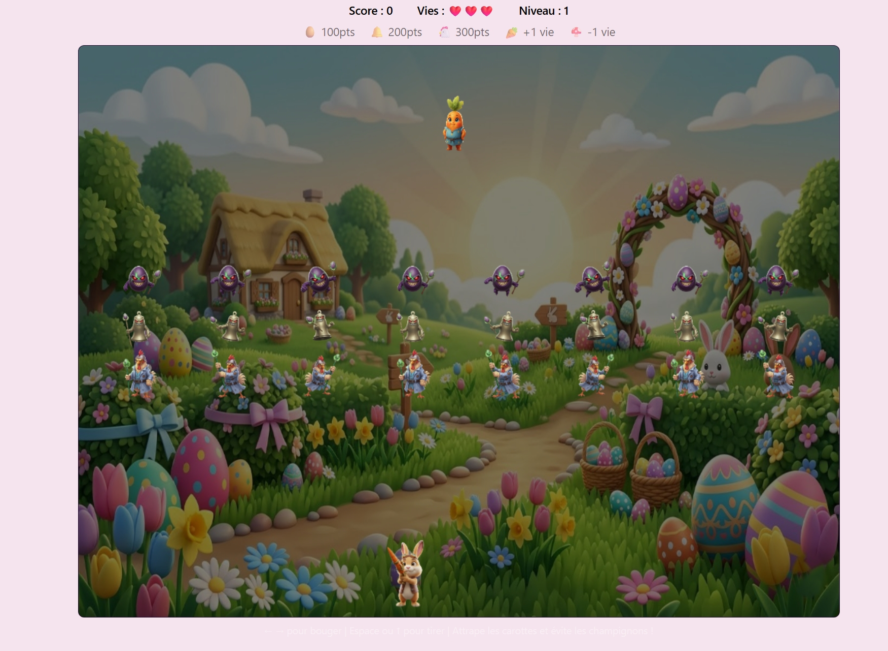
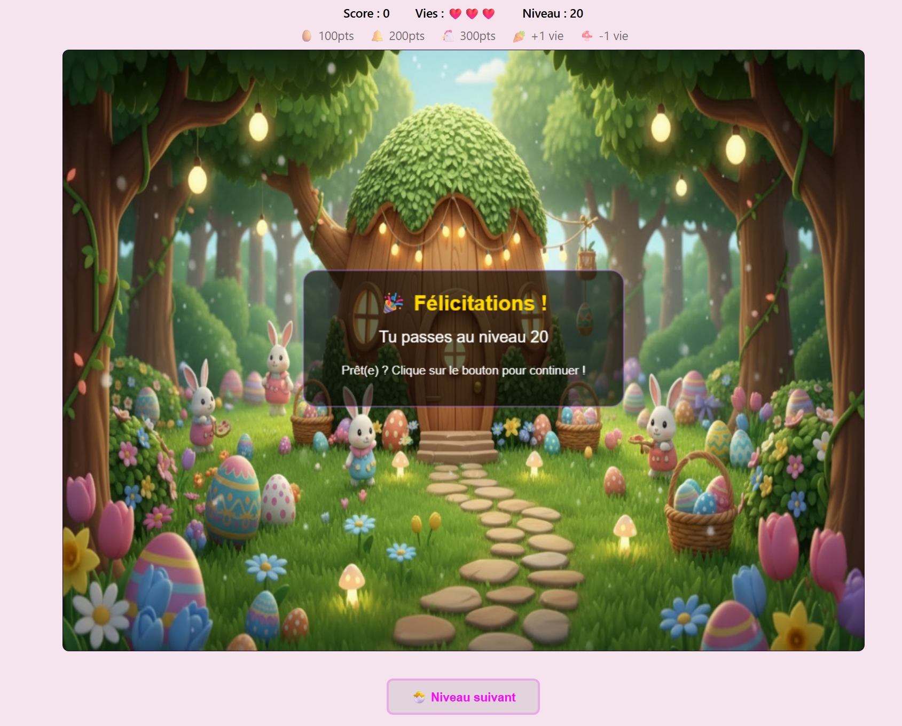

# 🐰 Easter Invaders 🐰

## Jeu arcade de type Space Invaders revisité aux couleurs de Pâques !

# Outils dev :
- HTML5 Canvas  
- JS 
- CSS3
- IA générative pour les fonds et personnages
- Assistance IA pour certaines fonctionnalités du jeu en JS

# Jeu avec une histoire complète : 
- 3 scénario : un au début, un entre le niveau 7 et 8 et un à la fin du jeu
- 3 types d'ennemis différents : Poulets démoniaques, Cloches infernales et Oeufs de paques méchants ! 
- 1 atout automatique au niveau 8 : Arme double tirs
- 20 niveaux progressifs avec des formations d'ennemis variées : Lines, Circle, Random, V et Zigzag.
- 1 système de scores persistant qui sauvegarde et affiche les 3 derniers meilleurs scores avec possibilité de mettre un pseudo. 
- Possibilité d'avoir des vies supplémentaires ou d'en perdre !
- Histoire : Papa Lapin doit sauver Maman Lapine capturée par Monsieur Poulet ! puis ses enfants !!
- Responsive sur smartphone.
- Mise en place de bonus de points à attraper (en cours).
- Mise en place d'un menu : (en cours)
    - Jouer
    - Niveaux
    - Scénario
    - Crédits

# Régle du jeu :
- Tirer sur les oeufs 100pts, les cloches 200pts et les poulets 300pts
- Eviter les champignons : - 1 vie
- Attraper les carottes : + 1 vie
- Passer les 20 niveaux pour sauver la famille Lapin

# Sur ordinateur :
- Tirer : Barre d'espace, Flèche ↑ ou click gauche
- Droite : Gauche : Flèches ← → ou souris

# Sur smartphone :
- Déplacement : Scroll de droite à gauche
- Tirer : appuyer sur l'écran

# Capture d'écran du jeu :

